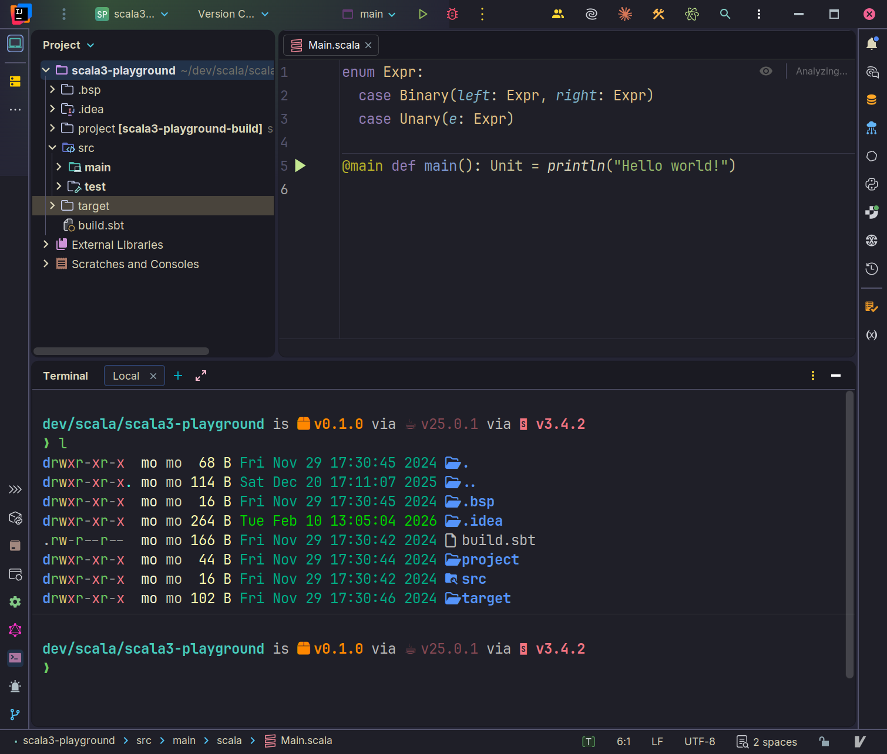

# Kanagawa Wave Island Theme

A dark theme for JetBrains IDEs inspired by the colors of the famous painting "The Great Wave off Kanagawa" by Katsushika Hokusai.

## About

This theme brings the beautiful and serene [Kanagawa](https://github.com/rebelot/kanagawa.nvim) color palette from Neovim to JetBrains IDEs. It features a carefully crafted dark color scheme with elegant accents in blues, greens, and warm tones inspired by traditional Japanese aesthetics.

## Features

- 🌊 **Beautiful Dark Theme**: Based on the popular Kanagawa Wave color palette
- 🎨 **Complete Syntax Highlighting**: Carefully chosen colors for all major programming languages
- 🏝️ **Islands Theme Compatible**: Works seamlessly with JetBrains' new Islands UI (2025.3+)
- 💙 **Easy on the Eyes**: Designed for long coding sessions with balanced contrast

## Color Palette

The theme uses the authentic Kanagawa color palette:

- **Backgrounds**: Dark sumiInk variants (elegant navy blacks)
- **Foreground**: fujiWhite (warm, readable text)
- **Accents**: crystalBlue, springGreen, sakuraPink, oniViolet
- **Keywords**: oniViolet (#957FB8)
- **Strings**: springGreen (#98BB6C)
- **Functions**: crystalBlue (#7E9CD8)
- **Classes**: carpYellow (#E6C384)
- **Errors**: samuraiRed (#E82424)

## Installation

### From JAR File

1. Download the latest `.jar` file from the releases
2. Open your JetBrains IDE (IntelliJ IDEA, PyCharm, WebStorm, etc.)
3. Go to **Settings/Preferences** → **Plugins**
4. Click the gear icon ⚙️ and select **Install Plugin from Disk...**
5. Select the downloaded JAR file
6. Restart your IDE
7. Go to **Settings/Preferences** → **Appearance & Behavior** → **Appearance**
8. Select **Kanagawa Wave** from the Theme dropdown

### From Source

1. Clone this repository
2. Open the project in IntelliJ IDEA
3. Build the plugin: **Build** → **Build Artifacts** → **Build**
4. The JAR file will be in `out/artifacts/`
5. Follow the steps above to install from disk

## Requirements

- JetBrains IDE version 2025.3 or later
- Java SDK 21

## Credits

This theme is based on the excellent [Kanagawa.nvim](https://github.com/rebelot/kanagawa.nvim) theme by [@rebelot](https://github.com/rebelot).

> "Kanagawa" is a dark color scheme inspired by the colors of the famous painting "The Great Wave off Kanagawa" by Katsushika Hokusai.

## License

This project is licensed under the MIT License - see the [LICENSE](LICENSE) file for details.

## Contributing

Contributions are welcome! If you find any issues or have suggestions for improvements:

1. Check the [Issues](../../issues) page
2. Open a new issue if your problem isn't already reported
3. Submit a pull request with improvements

## Acknowledgments

- Original theme: [Kanagawa.nvim](https://github.com/rebelot/kanagawa.nvim) by rebelot
- Inspired by "The Great Wave off Kanagawa" by Katsushika Hokusai
- Built for JetBrains IDEs with the Islands theme in mind

---

**Enjoy coding with Kanagawa! 🌊**
